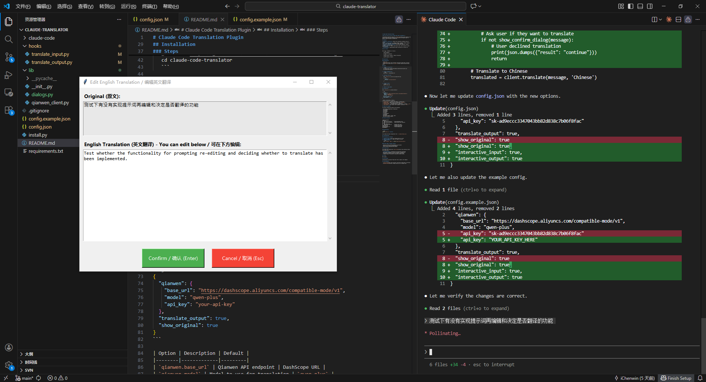

# Claude Code Translation Plugin

[简体中文](./README_zh.md) | English

**This can save 30%~50% on Claude Code tokens consumption.**

A hook-based translation plugin for [Claude Code](https://docs.anthropic.com/en/docs/claude-code) that automatically translates non-English input to English using the Qianwen (通义千问) API.

## Features

- **Automatic Translation**: Detects and translates non-English input to English
- **Multi-language Support**: Supports Chinese, Japanese, Korean, Russian, Arabic, Thai, Vietnamese, Greek, Hebrew, Hindi, and more
- **Preserves Claude Code Features**: Full VS Code integration, session management, and file access
- **Smart Detection**: Ignores code blocks, URLs, and file paths to avoid false positives
- **Configurable**: Enable/disable output translation via config file

## Preview



## How It Works

```
User Input (中文/日本語/한국어/etc.)
        ↓
   [Hook Triggered]
        ↓
   Qianwen API Translation
        ↓
   Claude receives: Original + English Translation
        ↓
   Claude responds in English
```

## Installation

### Prerequisites

- Python 3.8+
- [Claude Code](https://docs.anthropic.com/en/docs/claude-code) installed
- Qianwen API key (get one at [阿里云百炼](https://bailian.console.aliyun.com/))

### Steps

1. **Clone the repository**
   ```bash
   git clone https://github.com/iChenwin/claude-code-translator.git
   cd claude-code-translator
   ```

2. **Install dependencies**
   ```bash
   pip install -r requirements.txt
   ```

3. **Configure API key**

   Edit `config.json` and set your Qianwen API key:
   ```json
   {
     "qianwen": {
       "api_key": "your-api-key-here"
     }
   }
   ```

4. **Install hooks**
   ```bash
   python install.py
   ```

5. **Restart Claude Code**

## Configuration

Edit `config.json` to customize behavior:

```json
{
  "qianwen": {
    "base_url": "https://dashscope.aliyuncs.com/compatible-mode/v1",
    "model": "qwen-plus",
    "api_key": "your-api-key"
  },
  "translate_output": true,
  "interactive_input": true,
  "interactive_output": true
}
```

| Option | Description | Default |
|--------|-------------|---------|
| `qianwen.base_url` | Qianwen API endpoint | DashScope URL |
| `qianwen.model` | Model to use for translation | `qwen-plus` |
| `qianwen.api_key` | Your Qianwen API key | Required |
| `translate_output` | Translate Claude's output to user's language | `true` |
| `interactive_input` | Show a dialog allows you modify the English promt | `true` |
| `interactive_output` | Show a dialog lets you decide whether to translate the English result. (Not working.) | `true` |

## Supported Languages

The plugin automatically detects and translates:

- 🇨🇳 Chinese (Simplified & Traditional)
- 🇯🇵 Japanese
- 🇰🇷 Korean
- 🇷🇺 Russian
- 🇸🇦 Arabic
- 🇹🇭 Thai
- 🇻🇳 Vietnamese
- 🇬🇷 Greek
- 🇮🇱 Hebrew
- 🇮🇳 Hindi, Bengali, Telugu, Tamil
- And more non-Latin scripts...

## Project Structure

```
claude-translator/
├── hooks/
│   ├── translate_input.py      # UserPromptSubmit hook
│   └── translate_output.py     # Notification hook (optional)
├── lib/
│   ├── __init__.py
│   ├── dialogs.py              # Interactive dialogs (tkinter)
│   └── qianwen_client.py       # Qianwen API client
├── config.json                 # Plugin configuration
├── install.py                  # Installation script
├── requirements.txt            # Python dependencies
└── README.md
```

## Uninstallation

```bash
python install.py --uninstall
```

This removes the hook configuration from `~/.claude/settings.json`.

## Troubleshooting

### Translation not working?

1. **Check API key**: Ensure your Qianwen API key is valid
2. **Restart Claude Code**: Hooks are loaded on startup
3. **Test manually**:
   ```bash
   echo '{"prompt": "你好"}' | python hooks/translate_input.py
   ```

### No API usage in Qianwen console?

- Check the correct project/workspace in the console
- There may be a delay in usage reporting
- Verify the API key matches the project

## How Hooks Work

This plugin uses Claude Code's [hook system](https://docs.anthropic.com/en/docs/claude-code):

- **UserPromptSubmit**: Intercepts user input before processing
- Hook detects non-English text and translates via Qianwen API
- Translation is added as context for Claude to understand
- Original prompt is preserved; translation provides context

## License

MIT License

## Contributing

Contributions are welcome! Please feel free to submit a Pull Request.

## Acknowledgments

- [Claude Code](https://docs.anthropic.com/en/docs/claude-code) by Anthropic
- [Qianwen/通义千问](https://tongyi.aliyun.com/) by Alibaba Cloud
