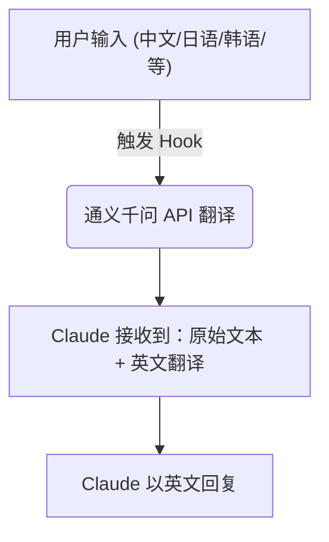

# Claude Code 翻译插件

**本插件可节省 30%~50% 的 Claude Code Token 消耗。**

这是一个基于 Hook 的 [Claude Code](https://docs.anthropic.com/en/docs/claude-code) 翻译插件。它通过通义千问 (Qianwen) API 自动将非英语输入翻译成英语，从而优化 Claude 的理解效率并节省 Token。

## 功能特性

- **自动翻译**：自动检测并将非英语输入翻译为英语。
- **多语言支持**：支持中文、日语、韩语、俄语、阿拉伯语、泰语、越南语、希腊语、希伯来语、印地语等。
- **保留原生功能**：完全兼容 VS Code 集成、会话管理和文件访问。
- **智能识别**：自动忽略代码块、URL 和文件路径，避免误翻译。
- **高度可配置**：可通过配置文件开启/关闭输出翻译。

## 预览


## 工作原理



## 安装指南

### 前置条件

- Python 3.8+
- 已安装 [Claude Code](https://docs.anthropic.com/en/docs/claude-code)
- 通义千问 API Key (可在 [阿里云百炼](https://bailian.console.aliyun.com/) 获取)

### 安装步骤

1. **克隆仓库**

   ```bash
   git clone https://github.com/iChenwin/claude-code-translator.git
   cd claude-code-translator
   ```

2. **安装依赖**

   ```bash
   pip install -r requirements.txt
   ```

3. **配置 API Key**

   编辑 `config.json` 并填入你的 API Key：

   ```json
   {
     "qianwen": {
       "api_key": "你的-api-key"
     }
   }
   ```

4. **安装 Hooks**

   ```bash
   python install.py
   ```

5. **重启 Claude Code**

## 配置说明

编辑 `config.json` 来自定义插件行为：

```json
{
  "qianwen": {
    "base_url": "https://dashscope.aliyuncs.com/compatible-mode/v1",
    "model": "qwen-plus",
    "api_key": "your-api-key"
  },
  "translate_output": true,
  "interactive_input": true,
  "interactive_output": true
}
```

### 选项说明

| 选项 | 描述 | 默认值 |
| :--- | :--- | :--- |
| `qianwen.base_url` | 通义千问 API 地址 | `DashScope` 官方地址 |
| `qianwen.model` | 用于翻译的模型 | `qwen-plus` |
| `qianwen.api_key` | 你的 API Key | **必填** |
| `translate_output` | 是否将 Claude 的输出翻译回用户语言 | `true` |
| `interactive_input` | 显示弹窗允许你修改翻译后的英文 Prompt | `true` |
| `interactive_output` | 显示弹窗决定是否翻译结果（暂未生效） | `true` |

## 项目结构

```text
claude-translator/
├── hooks/
│   ├── translate_input.py      # 用户输入处理 Hook
│   └── translate_output.py     # 通知处理 Hook (可选)
├── lib/
│   ├── __init__.py
│   ├── dialogs.py              # 交互式对话框 (tkinter)
│   └── qianwen_client.py       # 通义千问 API 客户端
├── config.json                 # 插件配置
├── install.py                  # 安装脚本
├── requirements.txt            # Python 依赖
└── README.md
```

## 卸载

```bash
python install.py --uninstall
```

这会从 `~/.claude/settings.json` 中移除 Hook 配置。

## 许可证

MIT License